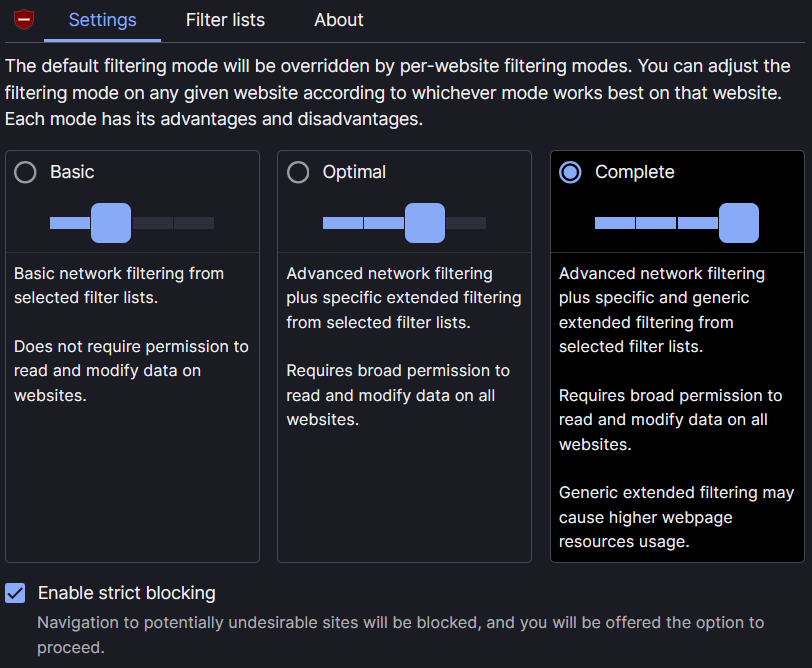

# Setup: Browser Extension & Browser

Panduan ini menjelaskan cara mengaktifkan ABPindo di berbagai browser dan ekstensi. Sebagian browser sudah mendukung ABPindo secara native tanpa perlu ekstensi tambahan.

---

## Brave Browser (Native — Tanpa Ekstensi)

Brave mendukung custom filter list secara native melalui mesin pemblokir bawaannya. ABPindo dapat ditambahkan langsung tanpa ekstensi tambahan.

**Desktop/Mobile:**

1. Buka `brave://adblock` di address bar.
2. Lihat bagian "Content filtering"
3. Gulir kebawah dan klik "See Full Lists", lalu cari dan centang ABPindo.
4. Filter akan diperbarui otomatis setiap minggu.

> **Catatan:** Pastikan Trackers & ads blocking di `brave://settings/shields` tidak dalam kondisi **Disabled**. dan Setel mode pemblokiran ke **Aggresive** untuk hasil yang sempurna (Dikarenakan Aggresive mode juga memblokir elemen level first-party.)

> **Ingin kontrol lebih penuh?** Pasang/Hidupkan ekstensi ekstensi uBlock Origin [disini](brave://settings/extensions/v2) dan ikuti panduan di bawah. uBlock Origin memberikan dukungan sintaks filter yang lebih lengkap termasuk scriptlet.

---

## uBlock Origin

1. Klik ikon **uBlock Origin** di toolbar browser.
2. Klik ikon ⚙ (*Open the dashboard*).
3. Buka tab **Filter Lists**.
4. Gulir ke bagian **Regions, languages**, lalu klik **+** untuk memperluas.
5. Cari **ID, MYS: ABPindo** dan centang kotaknya.
6. Klik **Apply changes** di bagian atas untuk menyimpan.

> **Khusus uBlock Origin Lite:** Setel *default filtering mode* ke **Complete** agar semua elemen terblokir. Tanpa ini, sebagian filter mungkin tidak aktif.



---

## AdGuard (App/Extension)

1. Buka **Settings** AdGuard.
2. Pilih tab **Filters**.
3. Masuk ke bagian **Language-specific**.
4. Temukan **ABPindo** dan aktifkan toggle-nya.
5. Klik **Apply** untuk memperbarui.

Atau tambahkan secara manual via **Custom filters** dengan URL berikut:

```
https://raw.githubusercontent.com/ABPindo/indonesianadblockrules/master/subscriptions/abpindo.txt
```

---

## Adblock Plus (ABP)

1. Klik ikon **Adblock Plus** di browser.
2. Pilih **Options**.
3. Buka tab **Filter Lists**.
4. Di bagian *Language-specific filters*, cari **ABPindo**.
5. Centang dan klik **Apply**.

Jika tidak ditemukan, tambahkan manual via tombol **Add a filter list** dengan URL:

```
https://raw.githubusercontent.com/ABPindo/indonesianadblockrules/master/subscriptions/abpindo.txt
```

---

## Ghostery

1. Klik ikon **Ghostery** di browser.
2. Pilih menu **hamburger > privacy protections**
3. Pilih **Additional Filters**
4. Hidupkan **Regional Block Lists**
5. Centang **Indonesian (id)***

---


## Troubleshooting

**ABPindo tidak muncul di daftar filter:**
- Pastikan bahasa browser sudah diatur ke **Indonesia** atau **Malaysia** (`Settings > Language`).
- Klik **Update now** di dashboard untuk memperbarui daftar filter.

**Masih ada iklan yang lolos:**
- Pastikan filter lain seperti EasyList dan EasyPrivacy juga aktif — ABPindo dirancang sebagai pelengkap, bukan pengganti.
- Laporkan melalui [GitHub Issues](https://github.com/ABPindo/indonesianadblockrules/issues) dengan menyertakan URL halaman dan tangkapan layar.

**Fitur situs rusak / gambar hilang:**
- Ini kemungkinan *false positive*. Nonaktifkan ABPindo sementara untuk konfirmasi, lalu laporkan di [GitHub Issues](https://github.com/ABPindo/indonesianadblockrules/issues).
